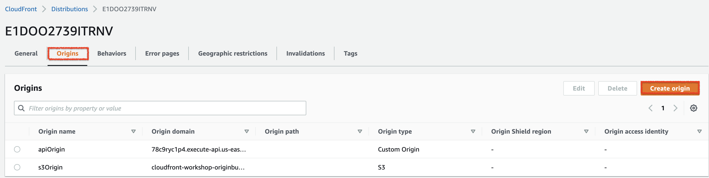

## Improve your architecture with Amazon CloudFront


## Preparation

### Prerequisites
* You need to have AWS account，and you may also need to choose **N.Virginia region (us-east-1)**.
* In this workshop, we will use the following services:
   * Amazon S3
   * Amazon CloudFront

## Scenario
In this lab, we will create a CloudFront Distribution, which will allow client to download content faster than when it uses public internet.
CloudFront also abstracts multiple origin backend into one domain, so that client does not need to contact them separately.


## Checking Stack Outputs

## Checking website origin
You will find an output **s3WebsiteDomain**, which will have value similar to http://cloudfront-workshop-originbucket-\ <random string>.s3-website-us-aest-1.amazonaws.com.
Click the link and see whether the static site opens correctly.
Currently its submenus such as API will not work correctly.


## Checking API endpoint

In the CloudFormation Output tab, you will find an output **apiOriginEndPoint** , which will have value simliar to https://<random string>.execute-api.us-east-1.amazonaws.com/api/.
Copy the value and test the API endpoint with the below curl command.

```bash
curl [apiOriginEndPoint]/echo
```
You will be able to see the results below:
```bash
curl https://78c9ryc1p4.execute-api.us-east-1.amazonaws.com/api/echo
{"Method":"GET","Path":"/api/echo","headers":{"accept":"*/*","Host":"78c9ryc1p4.execute-api.us-east-1.amazonaws.com","User-Agent":"curl/7.77.0","X-Amzn-Trace-Id":"Root=1-6230508b-69f1e4703b79f2412f79c73c","X-Forwarded-For":"111.82.192.10","X-Forwarded-Port":"443","X-Forwarded-Proto":"https"},"Time":1647333515618}%                  
```


## Build up CloudFront Distribution

As a first step, you will create a CloudFront Distribution.
CloudFront Distribution is a set of configurations that includes:

* Which host (Origin) CloudFront should reach for content
* How CloudFront should allow access from clients (Viewer)
* How CloudFront should treat contents in terms of cache
Once you create the CloudFront Distribution, it will provide a domain name that the viewers can use to retrieve content.


### Step-by-Step
* Go to the CloudFront console .
* Click Create distribution button. System will show start page.
* Use Origin domain drop down input to find [originBucket] (cloudfront-workshop-originbucket-<random string>) and select it.
* Change **Name** to s3Origin
* Scroll down and set Default root object as index.html
* Change Standard logging as On.
Select [logBucket](cloudfront-workshop-logbucket-<random string>) as S3 bucket.
* Put CloudFront Workshop in Description.
* Leave others as it is and click Create distribution.
* You will now see newly created CloudFront Distribution, with its status as Deploying. It means this CloudFront Distribution is being propagated to each and every CloudFront Edge locations and Regional Edge Caches.
* You will also see the domain name in the form of d1234abcd.cloudfront.net too.


But What if we want to add more origins? how to do that?

## Step-by-Step

Part 1. Adding new origins
* Open the CloudFront Distribution.
* Select Origins tab.
* Click Create origin button. Create Origin page will be shown.


* For Origin domain, input the domain name of [apiOriginEndPoint] from CloudFormation output. Ensure you use only <a1234abcd>.execute-api.us-east-1.amazonaws.com as input.
* Set Protocol to **HTTPS** Only.
* Set Name as *apiOrigin*.
* Leave others as it is and click Create Origin
* CloudFront Distribution detail page will be shown
* Click Create origin button again in the CloudFront Distribution detail.
* Input domain name of [videoOriginDomain] from CloudFormation output as Origin domain. Again, only Ensure you only use <abcd1234>.egress.mediapackage-vod.us-east-1.amazonaws.com as input.
* Set Protocol as **HTTPS** Only
* Set Name as *videoOrigin*.
* Leave others as it is and click Create origin to return the CloudFront Distribution detail page.

But after you setting up more origins to cloudfront, you have to route them to customer request.

## Controlling Cache
Caching the content is one of the core feature of CloudFront, and you can take the advantage most when you have optimized **cache time-to-live (TTL)**. For example, you may want to set the TTL of static objects as long as possible, and set a **short TTL to a frequent changing objects**.

Usually you will set up the TTL from origin, but you can also set up the TTL in CloudFront too.

CloudFront also gives you control which part of request to be used to look up the cache, besides the default cache key which is URI.

In this chapter, we will see how we can set TTL both in origin and CloudFront, and further optimize cache by modifying cache key.

### Controlling TTL from origin
HTTP carefully defined the cache mechanism, which includes HTTP response header Cache-Control from the server to define how long the downstream agents (e.g. client browser or middle cache server) can use the cached version without revalidating.
CloudFront follows cache TTL directive from origin by default, so let's see how you can set up the TTL from origin.


> What does it mean?
X-Cache: Miss from cloudfront: CloudFront didn't find the object in cache with requested URI, and reached origin to retrieve object.
X-Cache: Hit from cloudfront: CloudFront found the object in cache, and its age is still smaller than TTL. CloudFront also provides the age of this object in the cache with the header Age.
X-Cache: RefreshHit from cloudfront: CloudFront found the object in the cache, but its age has passed defined TTL, so CloudFront revalidated its freshness with origin. Revalidate was successful and CloudFront refreshed the age of this object.

### Controlling TTL from CloudFront

Set up your custom policy on cache policy!


### Controlling what to forward to origin

CloudFront by default do not forward query strings, cookies, and many of request headers. This reduces size of transmission and improves turn around time from origin.
However, sometimes the origin requires those values to provide correct response. You can configure CloudFront to forward selected headers, cookies, and query strings to support this requirement.


### Controlling cache key
CloudFront stores the objects in the cache with cache-key. By default, request URI is used as a cache-key. So whenever CloudFront receives a subsequent request, it looks the cache storage up with the request URI and find matching one.
However, sometimes the response of a same URI can vary based on request query string, cookies, or headers. You can configure cache key to cache those varying responses in CloudFront separately.


## Improve performance with CloudFront

## Improve security with CloudFront


## Improve reliability with CloudFront

## Monitoring CloudFront